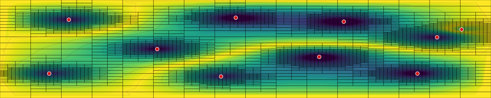
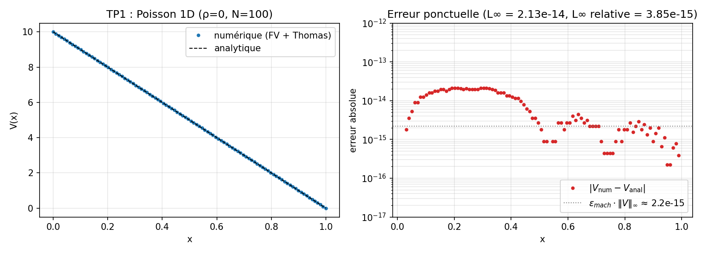
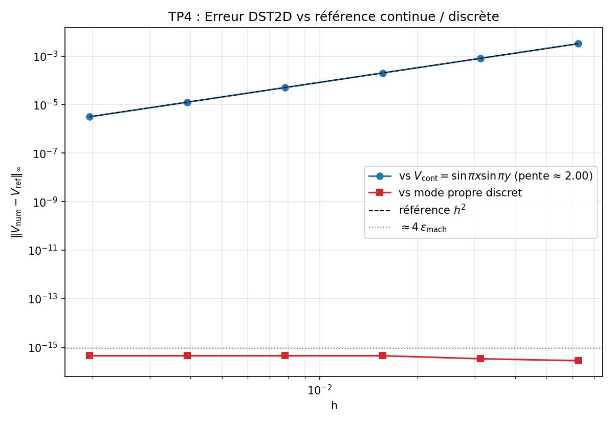
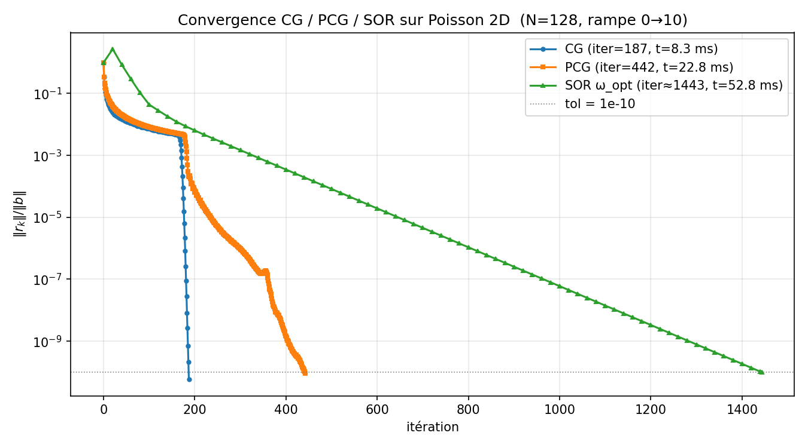
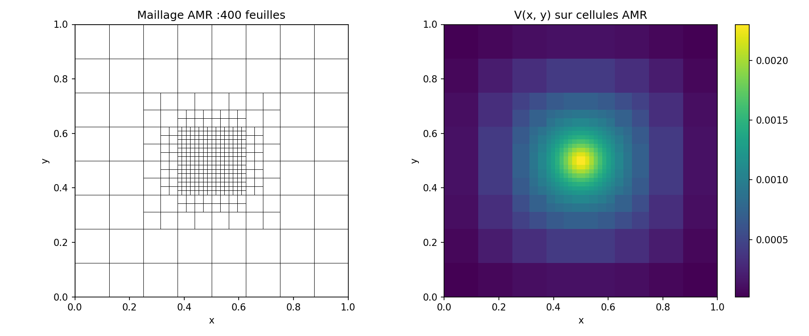

<div align="center">

# Poisson CPP

**C++20 library of Poisson solvers : finite volume, spectral, AMR + multigrid, Conjugate Gradient.**


</div>



<div align="center">
<sub>
Scène multi-charges (10 gaussiennes ±q) résolue par le solveur AMR :
5 287 feuilles quadtree, SOR convergé à 10⁻⁸ en 300 itérations.
Fond = |V| (viridis), courbes = équipotentielles, points rouges = charges.
Reproduction : <a href="python/make_banner.py"><code>python/make_banner.py</code></a>.
</sub>
</div>

---

## Solveurs

| Module | Algorithme | Coût | BC supportées |
|---|---|---|---|
| [`linalg::thomas`](include/poisson/linalg/thomas.hpp) | Tridiagonal direct | O(N) | toutes |
| [`fv::Solver1D`](include/poisson/fv/solver1d.hpp) | FV + Thomas | O(N) | Dirichlet (ε uniforme ou variable) |
| [`fv::Solver2D`](include/poisson/fv/solver2d.hpp) | FV + SOR red-black ω_opt | O(N³) | Dirichlet×Neumann |
| [`iter::solve_poisson_cg`](include/poisson/iter/poisson_cg.hpp) | CG / PCG Jacobi | O(N³), ~5× SOR | Dirichlet×Neumann |
| [`spectral::DSTSolver2D`](include/poisson/spectral/dst2d.hpp) | DST-I via FFTW | O(N²·logN) | Dirichlet homogène |
| [`amr::Quadtree` + `sor`](include/poisson/amr/solver.hpp) | Quadtree Morton + FV hétérogène | O(nb_leaves × iter) | Dirichlet V = 0 au bord |
| [`mg::vcycle_amr_composite`](include/poisson/mg/vcycle.hpp) | V-cycle 2-grid composite AMR | O(nb_leaves) par cycle | Dirichlet V = 0 |

Tous matrix-free (stencils explicites, pas de matrice sparse stockée).
Conventions de grille et schémas dans [`docs/ARCHITECTURE.md`](docs/ARCHITECTURE.md).

## Quick start

### Prérequis

- C++20 (AppleClang 16+, GCC 12+, Clang 15+, MSVC 19.36+)
- CMake ≥ 3.20
- Eigen ≥ 3.4 *(fetched automatiquement si absent)*
- FFTW3 *(optionnel, active le solveur spectral)*
- OpenMP *(optionnel, parallel sweeps à partir de N ≥ 384)*
- Python 3.9+ *(optionnel, bindings pybind11)*

### Build

```bash
git clone https://github.com/wolf75222/poisson_cpp.git
cd poisson_cpp
cmake -B build -DCMAKE_BUILD_TYPE=Release
cmake --build build -j
ctest --test-dir build                              # 66/66 doit passer
```

Options CMake :

| Option | Défaut | Rôle |
|---|---|---|
| `POISSON_BUILD_TESTS` | `ON` | Compile Catch2 + toute la suite |
| `POISSON_BUILD_BENCHMARKS` | `ON` | Compile `bench_solvers` et `profile_cg` |
| `POISSON_USE_OPENMP` | `OFF` | Parallélise SOR + gs_smooth au-delà de N ≥ 384 |
| `POISSON_BUILD_PYTHON` | `OFF` | Génère le module `poisson_cpp` via pybind11 |

### Exécuter le démo C++

```bash
# 1D Poisson + dump JSON
./build/examples/poisson_demo --problem poisson1d --N 100 --uL 10 --uR 0 \
    --output /tmp/p1d.json

# SOR 2D avec historique de convergence
./build/examples/poisson_demo --problem sor2d --N 128 --uR 10 --tol 1e-10

# Spectral 2D (nécessite FFTW)
./build/examples/poisson_demo --problem spectral2d --N 256

# Scène AMR multi-charges (utilisée pour la bannière)
./build/examples/poisson_demo --problem amr_scatter --Nmin 4 --Nmax 7 \
    --sigma 0.025 --output data/snapshots/amr_scatter.json
```

---

## Utilisation depuis Python (pybind11)

Build du module :

```bash
cmake -B build -DPOISSON_BUILD_PYTHON=ON
cmake --build build --target poisson_py -j
export PYTHONPATH=$PWD/build/python
```

### Exemple

```python
import numpy as np
import poisson_cpp as pc

# ---- 1. Thomas (tridiagonal direct, 1D) --------------------------------
N = 100
a = np.zeros(N); b = 2.0 * np.ones(N); c = np.zeros(N); d = np.ones(N)
a[1:] = -1.0; c[:-1] = -1.0
x = pc.thomas(a, b, c, d)
print("thomas:", x[:3])                    # [1.0, 2.0, ... ]

# ---- 2. Solver2D — FV + SOR red-black ω_opt auto -----------------------
grid = pc.Grid2D(1.0, 1.0, 64, 64)         # [0,1]² cell-centered
sor  = pc.Solver2D(grid, eps=1.0, uL=0.0, uR=10.0)   # Dirichlet x, Neumann y
rho  = np.zeros((64, 64))
V, report = sor.solve(rho, tol=1e-10)      # returns (V, SORReport)
print(report)                              # SORReport(iterations=..., residual=...)

# ---- 3. Conjugate Gradient --------------------------------------------
V_cg = np.zeros((128, 128), order="F")     # Fortran-order pour Eigen in-place
grid = pc.Grid2D(1.0, 1.0, 128, 128)
rep, hist = pc.solve_poisson_cg(
    V_cg, np.zeros((128, 128), order="F"), grid,
    uL=0.0, uR=10.0, tol=1e-10, record_history=True)
print(f"CG: {rep.iterations} iterations, residual {rep.residual:.2e}")

# ---- 4. Spectral DST-I (si FFTW disponible) ----------------------------
if pc.has_fftw3:
    dst = pc.DSTSolver2D(127, 127, 1.0, 1.0, eps0=1.0)
    rho_dst = np.random.randn(127, 127)
    V_dst = dst.solve(rho_dst)
    print("DST2D V range:", V_dst.min(), V_dst.max())
```

### Plots

```bash
python3 python/plot_tp_style.py all           # TP1..TP5 reproduites
python3 python/plot_cg.py                     # convergence CG vs SOR
python3 python/make_banner.py                 # bannière AMR multi-charges
```

Figures dans [`docs/figures/`](docs/figures/), interprétations dans
[`docs/RESULTS.md`](docs/RESULTS.md).

---

## Résultats

<div align="center">

|  |  |
|---|---|
|  |  |
| TP1 : Poisson 1D, erreur L∞ = 2.1×10⁻¹⁴ (précision machine) | TP4 : convergence spectrale, pente log-log = +2.000 |
|  |  |
| CG : 187 iter / 8 ms vs SOR 1443 / 53 ms | TP5 : AMR sur Gaussienne centrée, 400 feuilles, ×10 vs uniform |

</div>

---

## Performance

Détails dans [`docs/PERFORMANCE.md`](docs/PERFORMANCE.md). A/B mesurés
avec `sample` / `xctrace` :

- `mg::gs_smooth` N=128 : in-place red-black, −68 %.
- `Solver2D::solve` N=128 : in-place red-black + `Vc_inv_` précomputé, −46 %.
- `amr::sor` : précalcul `rhs = h²ρ/ε₀` et `Vc_inv`, −16 %.
- `Solver2D::solve` : fold Dirichlet → rhs pour débloquer SIMD, −5 %.
- CG `apply_neg_laplacian` N=512 : `diag_mat` précomputé hors hot loop, −18 %.
- OpenMP (opt-in, N ≥ 384) : Solver2D + gs_smooth, ×1.5 à ×1.9.

## Tests

66 tests Catch2, `ctest --test-dir build`. Couvrent :

- Invariants mathématiques (réciprocité de Green, linéarité, symétrie
  de réflexion) à 1e-13.
- Lois de conservation (Gauss, énergie, continuité D aux interfaces
  diélectriques) à 1e-12.
- 4 snapshots JSON vs les notebooks Python à 1e-10.
- Convergence O(h²) sur un benchmark Fourier (Jackson ch.2).
- Scaling CG en O(N), cross-check vs DST.

Détails : [`docs/RESULTS.md`](docs/RESULTS.md) (figures TP1–TP5),
[`docs/PERFORMANCE.md`](docs/PERFORMANCE.md) (benchmarks A/B + profiling).

## License

BSD-3-Clause. Voir [LICENSE](LICENSE).
