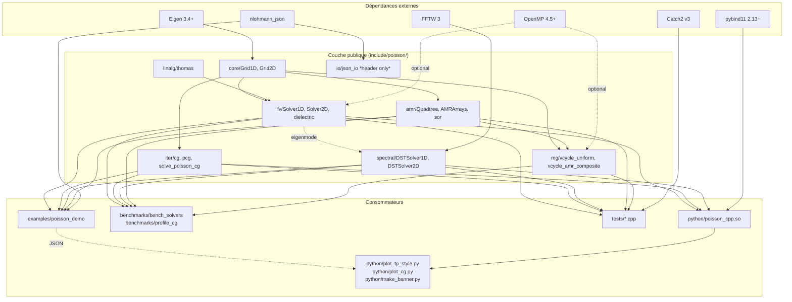
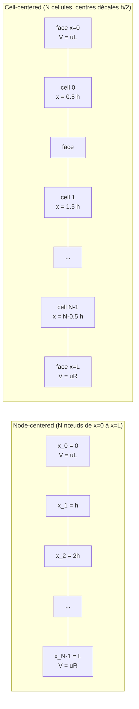
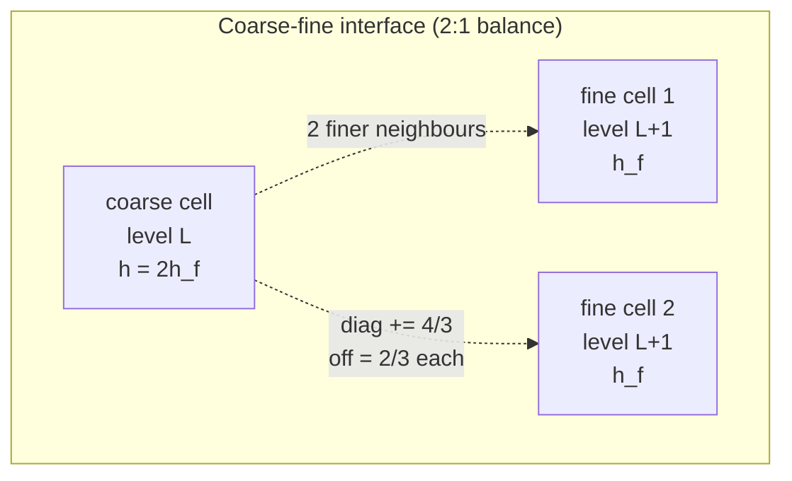
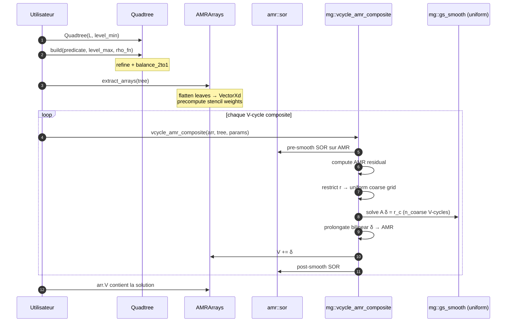

# Architecture

## Vue d'ensemble



## Layout des répertoires

```
poisson_cpp/
├── CMakeLists.txt                 # Build config racine
├── cmake/FindFFTW3.cmake          # Module FFTW3 portable
├── include/poisson/               # API publique
│   ├── core/          grid.hpp
│   ├── linalg/        thomas.hpp
│   ├── fv/            solver1d.hpp, solver2d.hpp, dielectric.hpp
│   ├── iter/          cg.hpp, poisson_cg.hpp
│   ├── spectral/      dst1d.hpp, dst2d.hpp, fftw_wrap.hpp
│   ├── amr/           morton.hpp, quadtree.hpp, solver.hpp
│   ├── mg/            vcycle.hpp
│   └── io/            json_io.hpp          (header-only, non installé)
├── src/                           # Implémentations
├── tests/                         # 66 tests Catch2, 11 fichiers
├── benchmarks/                    # bench_solvers, profile_cg
├── examples/                      # poisson_demo (CLI dispatcher)
├── python/                        # bindings.cpp + plot_*.py
├── data/
│   ├── snapshots/                 # JSON refs (amr.json, amr_scatter.json)
│   └── reference/                 # TP snapshots dumpés par dump_reference.py
└── docs/                          # ARCHITECTURE, RESULTS, PERFORMANCE
    └── figures/                   # PNG produits par python/plot_*.py
```

## Conventions de grille par module

Le projet mélange **deux conventions** de discrétisation. Chacune est
documentée dans le header correspondant ; ne pas les mélanger.



| Module | Convention | BC |
|---|---|---|
| `fv::Solver1D`, `fv::solve_poisson_1d` (dielectric) | **Node-centered**, N nœuds | Dirichlet aux 2 extrémités |
| `fv::Solver2D` | **Cell-centered**, Nx×Ny cellules | Dirichlet en x (uL, uR), Neumann en y |
| `spectral::DSTSolver1D/2D` | **Node-centered**, N internes (x_i = i·h) | Dirichlet homogène partout |
| `amr::Quadtree` | **Cell-centered** (leaves à profondeur variable) | Dirichlet V = 0 au bord du domaine |
| `mg::vcycle_uniform` | **Cell-centered** (même que gs_smooth) | Dirichlet V = 0 sur les 4 faces |

## Stencil FV hétérogène (AMR)

Dérivé dans `CourseOnPoisson/notebooks/TP5_AMR_Poisson_2D.ipynb` et
miroité dans `amr::extract_arrays`. Pour une cellule feuille face à un
voisin :



| Configuration du voisin | `diag +=` | `off =` (par voisin) |
|---|---|---|
| Bord du domaine (Dirichlet V = 0) | **2** | 0 |
| Même niveau | **1** | 1 |
| Plus grossier (1 voisin) | **2/3** | 2/3 |
| Plus fin (2 voisins) | **4/3** | 2/3 chacun |

Ces poids sont **localement conservatifs** et préservent l'identité
discrète `Σ F_face = h² ρ` à chaque cellule (vérifié par
[`tests/test_conservation.cpp`](../tests/test_conservation.cpp)).

## Morton encoding (clés quadtree)

Les clés de cellule sont `uint64_t` empaquetant `(level, i, j)` de façon
que les enfants d'une cellule soient adjacents en ordre numérique.

```
bits 0..55 : (i, j) bit-interleaved (28 bits chacun, max level 28)
bits 56..63: level
```

L'encodage utilise `_pdep_u64` quand disponible (BMI2), avec un
fallback portable sinon. Voir
[`include/poisson/amr/morton.hpp`](../include/poisson/amr/morton.hpp).

## Pipeline d'une résolution AMR composite



## Propriétés mathématiques vérifiées aux tests

- **Opérateur self-adjoint** (Green's reciprocity) :
  `G(r_A, r_B) = G(r_B, r_A)` à 10⁻¹³.
- **Exactitude polynomiale** : le stencil 5-points est exact sur
  `V = x(1-x)·y(1-y)`, vérifié à 10⁻¹³.
- **Loi de Gauss** : `ε₀ ∮ ∂V/∂n dℓ = Q_enclosed` à 10⁻¹² en
  discret.
- **Identité énergétique** : `½ ∫ ρV dA = ½ ε₀ ∫ |∇V|² dA` à 10⁻¹²
  (summation-by-parts sur le stencil).
- **Continuité de D** à travers des couches diélectriques : 10⁻¹².
- **Convergence CG** : O(√κ) ≈ O(N) itérations, vérifié par scaling
  N ∈ {64, 128, 256}.
- **Conservation de flux par cellule** (AMR) : à chaque cellule de
  l'arbre, `Σ F_face = h²ρ` après convergence SOR.

## Thread safety

- Solveurs **réentrants sur instances séparées**.
- **Pas** thread-safe sur la même instance car les scratch buffers
  FFTW (`in_`, `out_`) dans `DSTSolver*` sont `mutable`. Spawn une
  instance par thread pour du parallélisme concurrent.
- SOR / CG / gs_smooth : pas d'état partagé au-delà de `V` et `rho`,
  donc plusieurs threads peuvent les appeler sur des données
  disjointes.

## Contract d'installation

`install(EXPORT poissonTargets ...)` publie `poisson::poisson`. Un
consommateur en aval n'a besoin que de :

```cmake
find_package(poisson CONFIG REQUIRED)
target_link_libraries(my_app PRIVATE poisson::poisson)
```

Eigen3 est propagé comme dépendance publique. FFTW3 est une dépendance
publique quand la librairie est compilée avec `POISSON_HAVE_FFTW3`.

## Limitations connues

- Seuls des domaines **carrés** à la racine du quadtree (Lx = Ly).
- L'encodage Morton limite à 28 niveaux (≡ grille uniforme 256M × 256M).
- Pas de BC Neumann pour les solveurs spectraux (DST-I ⇒ Dirichlet
  homogène). Utiliser `fv::Solver2D` pour Dirichlet/Neumann mixte.
- Le V-cycle composite utilise la re-discrétisation, **pas un opérateur
  Galerkin**. Facteur de réduction par cycle observé ~0.7 sur AMR vs
  ~0.1 pour un multigrille Galerkin.
