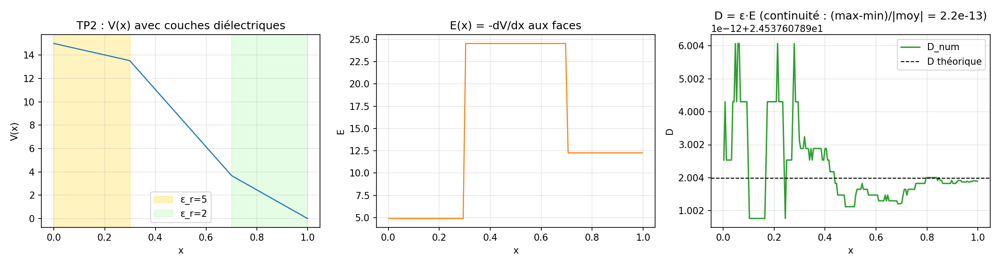
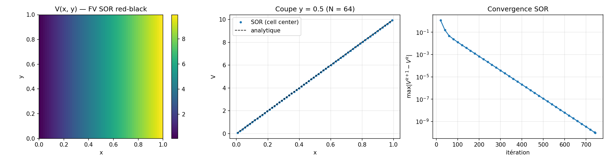
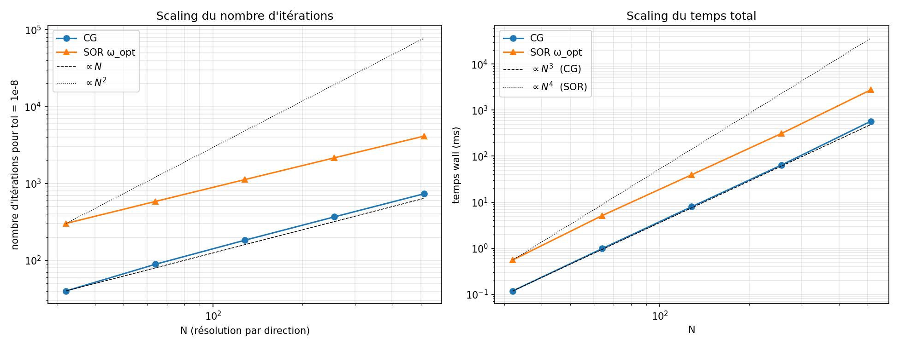

# Résultats

Figures des TPs `CourseOnPoisson/notebooks/TP{1..5}_*.ipynb` reproduites
en C++ par [`python/plot_tp_style.py`](../python/plot_tp_style.py).

```bash
cmake -B build -DPOISSON_BUILD_PYTHON=ON && cmake --build build -j
./build/examples/poisson_demo --problem amr --Nmin 3 --Nmax 6 \
    --sigma 0.04 --output data/snapshots/amr.json
PYTHONPATH=build/python python3 python/plot_tp_style.py all
```

## Chiffres clés

| TP | Mesure | Valeur | Attendu |
|---|---|---|---|
| TP1 | L∞ relative vs analytique | 3.9×10⁻¹⁵ | ε_mach |
| TP1 | ‖V_cpp − V_scipy‖∞ | 7.1×10⁻¹⁴ | ULP |
| TP2 | (max−min)/\|D\|_moy à travers 3 couches ε | 2.2×10⁻¹³ | ε_mach |
| TP3 | std(V, axis=1) sous Neumann y | 2.6×10⁻¹¹ | tol SOR |
| TP4 | pente log-log, erreur vs sin continu | +2.000 | +2 (O(h²)) |
| TP4 | erreur vs mode propre discret | 4.4×10⁻¹⁶ | ε_mach |
| TP5 | ∫∫ρ numérique vs πσ² | 0.00503 / 0.00503 | 0 % |
| TP5 | V_peak AMR vs DST 255² | 0.5 % | < 1 % |

---

## TP1 : Poisson 1D Dirichlet


`V''=0` sur [0, L] avec Dirichlet `(uL, uR)` ⇒ rampe linéaire
analytique. Solveur : `fv::solve_poisson_1d` (FV 3-points + Thomas).

`‖V_num − V_analytique‖∞ = 2.1×10⁻¹⁴` à N=100, soit 3.9×10⁻¹⁵ relatif.
Plancher `ε_mach · ‖V‖∞ ≈ 2.2×10⁻¹⁵`. Le schéma VF est exact sur les
polynômes de degré ≤ 2 (troncature `h² V''''/12 = 0`), donc l'erreur
résiduelle est pure accumulation d'arrondis Thomas.

La bosse asymétrique observée sur le panneau de droite n'est pas un
bug : le forward sweep de Thomas (i=1→N−1) accumule les arrondis
proportionnellement à i, puis la back-substitution repart de uR=0
et ré-épingle l'erreur à droite. Cross-check externe :
`‖V_cpp − V_scipy.solve_banded‖∞ = 7.1×10⁻¹⁴`, du même ordre que
l'écart à l'analytique.

---

## TP2 : Couches diélectriques 1D



`∇·(ε∇V) = 0` avec `ε_r(x) = {5, 1, 2}` en 3 couches, Dirichlet
`V(0)=15, V(1)=0`. Solveur : Thomas sur le système FV avec moyenne
harmonique de ε aux faces.

`D(x) = ε·E(x)` doit être constant partout (pas de charge libre,
`∇·D = 0`). Observé : `(max−min)/|D|_moy = 2.2×10⁻¹³`, soit la
précision machine. Principe physique : continuité du déplacement
normal à travers les interfaces diélectriques (Griffiths §4.4).

---

## TP3 : SOR red-black 2D



`∇²V=0`, Dirichlet en x, Neumann en y, pas de source ⇒ rampe linéaire
en x indépendante de y. Solveur : `fv::Solver2D` cell-centered avec
ω_opt = 2/(1 + sin(π/N)).

N=64, tol=1e-10 : 743 itérations. `std(V, axis=1).max() = 2.6×10⁻¹¹`
(Neumann en y bien capturée). Erreur vs rampe analytique : 3.3×10⁻⁹.
Panneau droit : décroissance quasi-géométrique du résidu, pente
contrôlée par ω_opt (un ω=1 requerrait ~10× plus d'itérations).

Coût total `O(N³)` (O(N²) par balayage × O(N) itérations avec ω_opt).

---

## TP4 : Convergence spectrale O(h²)


Solution manufacturée `V = sin(πx)·sin(πy)`, solveur
`spectral::DSTSolver2D` (DST-I via FFTW, diagonalisation exacte).

- Courbe bleue, **vs sinus continu** : pente log-log = +2.000, soit
  O(h²). C'est l'erreur de discrétisation seule (valeurs propres
  discrètes `4 sin²(kπh/2)/h²` ≠ continues `(kπ/L)²`).
- Courbe rouge, **vs mode propre discret** (ρ = λ^disc · V) :
  ~5×10⁻¹⁶ sur toutes les résolutions. Le DST inverse le Laplacien
  discret exactement.

Coût `O(N² log N)` par solve. À N=512 : 8 ms (vs ~2.5 s pour SOR à
même précision). Compromis : DST exige Dirichlet homogène sur les
4 faces.

---

## TP5 : AMR quadtree sur Gaussienne


`−ε₀∇²V = ρ` avec ρ = exp(−r²/σ²) centrée, boîte [0,1]² à la terre,
σ=0.04, raffinement 3 ≤ level ≤ 6. Solveur : `amr::extract_arrays
+ amr::sor`, stencil FV hétérogène `{2, 1, 2/3, 4/3}` aux interfaces
coarse-fine.

400 feuilles (level 3 : 48, level 4 : 32, level 5 : 64, level 6 :
256). Maillage uniforme équivalent à level 6 = 4⁶ = 4096 cellules,
soit un gain ×10.

Vérifications physiques :

- **Gauss** : `Σ ρ_i h_i² = 0.00503 = πσ²` (intégrale de exp(−r²/σ²)
  sur R² ; la décroissance exponentielle rend la contribution
  hors-boîte négligeable). Écart : 0 %.
- **Comparaison V_peak** : `V_peak_AMR = 2.30×10⁻³` vs
  `V_peak_DST_255² = 2.31×10⁻³`, soit 0.5 % avec 10× moins de
  cellules. L'écart vient du stencil ordre 1 aux interfaces 2:1,
  d'où la prolongation bilinéaire dans le V-cycle composite.
- Contrainte 2:1 : `Quadtree::balance_2to1`, testé dans
  [`test_quadtree.cpp`](../tests/test_quadtree.cpp).
- Conservation des flux : `Σ F_face = h²ρ` par cellule, testé dans
  [`test_conservation.cpp`](../tests/test_conservation.cpp).

---

## CG : Gradient Conjugué




Même problème que TP3 (rampe linéaire), trois solveurs comparés à
tol=1e-10. Solveur : `iter::solve_poisson_cg`, matrix-free, fold des
BCs Dirichlet dans le RHS puis CG sur l'opérateur SPD.

À N=128 :
- CG : 187 itérations, 8.3 ms.
- PCG Jacobi : 442 iter, 22.8 ms. *Plus lent* que CG ici car la
  diagonale est quasi-constante à ε uniforme (Jacobi n'aide que
  quand diag(A) varie fortement).
- SOR ω_opt : 1443 iter, 52.8 ms.

Signature CG : plateau à ~10⁻² pendant ~170 itérations (construction
du sous-espace Krylov), puis chute super-linéaire jusqu'à 10⁻¹⁰. En
arithmétique exacte, CG termine en ≤ N itérations (ici N=128).

Scaling sur N ∈ {32, 64, 128, 256, 512} : les deux solveurs sont en
O(N) itérations, mais CG a une constante ~5× plus petite. Wall time
total : O(N³), CG ~5× plus rapide que SOR à toutes les résolutions.
